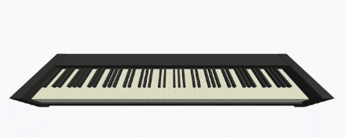

# Chords

## Introduction


Chords is an online chord detection application developed by Peter Ju.

By connecting your laptop to a MIDI Input source, Chords detects the corresponding chord you are playing real-time.

## Algorithm
The algorithm used for chord detection is based on rotation and pattern-matching. Say we have an array of notes like this:
```text
[C4, B3, G4, E3, C5]
```

In order to perform chord detection, we have to determine their bass note. We sort the array on a number-first approach and we get this:

```text
[E3, B3, C4, G4, C5]
```

As we can see, the bass note of this sequence is `E3`. We then have to determine which specific chord it is. To do so, I figured out a pattern-matching algorithm for notes that is based on their relative distances. As we know, the distance between `E3` and `B3`, the two lowest notes in the example, is 7, since there are exactly 7 half steps in between these two notes. There is also no need to consider octave notes since we eventually care about the distance between the notes with them being within an octave, so we do have to scale them. Taken from this, we normalize the array:
```text
[E3, B3, C4, G4, C5] => [E3, B3, C4, G4] => [0, 7, 8, 3] => [0, 3, 7, 8]
```

After this, we would want to match the chord patterns defined. However, since there are multiple voicings (ways of organizing the same notes) for the same chord, using a rotation-based approach would work: if none of the patterns match what we have, we rotate the array so that the first element become the last, normalize the array again, and compare once more. Repeat the process until every possible rotation is compared, and then we know that this is not a chord defined by the pattern.

In this case, `[E3, B3, C4, G4, C5]` would be a `CMaj7/E` chord. A C major 7th chord pattern would look like this: `[0, 4, 7, 11]`.

And now we compare and rotate (the 0 became 12 when rotated, since there are a total of 12 half steps within an octave):

```text
[0, 3, 7, 8] =(rotate)=> [3, 7, 8, 0] =(normalize)=> [0, 4, 5, 9]
```

Doesn't seem quite like what we wanted. Let's repeat the process:

```text
[0, 4, 5, 9] => [0, 1, 5, 8] => [0, 4, 7, 11]
```

And there we have it! Adding in the information we had previously about the bass note `E`, a C major 7th chord sitting on `E` would be: `CMaj7/E`.

## Installation
1. Clone repository.
    ```bash
    git clone https://github.com/peterju00004/chords.git
    ```
2. Switch to the project root directory.
3. Install dependency.
    ```bash
    npm i
    ```
4. To run: `npm run dev`.